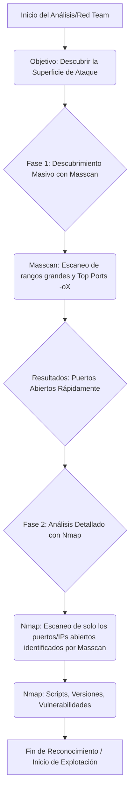

# 🗺️ Guía de Operación: Masscan en el Flujo de Análisis de Vulnerabilidades

## I. Flujo de Trabajo Metodológico (Masscan en el Reconocimiento)

Masscan no reemplaza a Nmap, sino que lo precede. Es la herramienta de **descubrimiento de superficie de ataque** a velocidad de rayo.

