# 🗺️ Guía de Operación: Masscan en el Flujo de Análisis de Vulnerabilidades

## I. Flujo de Trabajo Metodológico (Masscan en el Reconocimiento)

Masscan no reemplaza a Nmap, sino que lo precede. Es la herramienta de **descubrimiento de superficie de ataque** a velocidad de rayo.

```mermaid

graph TD

A[Inicio del Análisis/Red Team] --> B(Objetivo: Descubrir la Superficie de Ataque);

B --> C{Fase 1: Descubrimiento Masivo con Masscan};

C --> D(Masscan: Escaneo de rangos grandes y Top Ports -oX);

D --> E{Resultados: Puertos Abiertos Rápidamente};

E --> F{Fase 2: Análisis Detallado con Nmap};

F --> G(Nmap: Escaneo de solo los puertos/IPs abiertos identificados por Masscan);

G --> H(Nmap: Scripts, Versiones, Vulnerabilidades);

H --> I[Fin de Reconocimiento / Inicio de Explotación];
```

